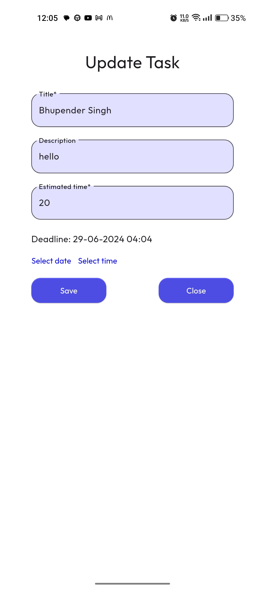

# Task Management App

## Overview
This is a simple task management application built with Flutter and Firebase. The app supports user authentication, task creation, reading, updating, and deletion using Firestore. Additionally, it provides notifications 10 minutes before a task's deadline.

## Features
- **User Authentication**: Email and password login and registration using Firebase Authentication.
- **Task Management**: CRUD operations for tasks stored in Firestore.
  - **Title**: A short description of the task.
  - **Description**: A detailed explanation of the task.
  - **Deadline**: The date and time when the task is due.
  - **Expected Task Duration**: Estimated time to complete the task.
  - **Completion Status**: A button to mark the task as complete.
- **Notifications**: Alerts the user 10 minutes before the task deadline.
- **Responsive UI**: Ensures a user-friendly interface on various devices.

## Screenshots
<p align="center">
  
  
  
  
  
  
</p>


## Installation
Follow these steps to set up and run the project:

1. **Clone the repository**:
    ```bash
    git clone https://github.com/yourusername/task_management_app.git
    cd task_management_app
    ```

2. **Set up Firebase**:
    - Create a Firebase project on the [Firebase Console](https://console.firebase.google.com/).
    - Enable Email/Password authentication in the Firebase Authentication section.
    - Create a Firestore database.
    - Download the `google-services.json` file and place it in the `android/app` directory.

3. **Install dependencies**:
    ```bash
    flutter pub get
    ```

4. **Run the app**:
    ```bash
    flutter run
    ```

## Usage

### User Authentication
- **Register**: Enter your email and password to create a new account.
- **Login**: Use your registered email and password to log in.

### Task Management
- **Create Task**: Fill in the form with task details (title, description, deadline, expected duration) and save.
- **Read Tasks**: View the list of tasks.
- **Update Task**: Tap on a task to edit its details.
- **Delete Task**: Swipe a task to delete it.
- **Mark as Complete**: Tap the complete button to mark a task as completed.

### Notifications
- The app will send a local notification 10 minutes before the task's deadline.

## Project Structure
